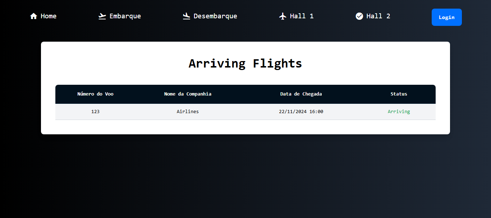

# Airport System

> Sistema web desenvolvido para o gerenciamento de voos.

---

## 📜 Sobre o Projeto

O **Airport System** é um sistema de gerenciamento de voos que oferece funcionalidades específicas para dois tipos de usuários:  
- **Administradores:** Podem cadastrar, atualizar e visualizar os estados dos voos.  
- **Clientes:** Têm acesso aos totens de informações de voos, onde podem visualizar detalhes importantes dos voos disponíveis no sistema.  

O objetivo é simplificar a administração e a consulta de voos, garantindo uma interface intuitiva e funcional.

---

## 🚀 Tecnologias Utilizadas

- **Back-end:** Java, JSP, Servlet  
- **Front-end:** HTML, CSS, TailwindCSS  

---

## 📸 Screenshots

### Página Inicial  
Apresenta as principais funcionalidades e acesso ao sistema.  

### Login do Administrador  
Interface de autenticação para administradores.  

### Tabela de Voos e Cadastro (Administrador)  
Visão geral dos voos cadastrados e formulário para incluir novos voos.  

### Cadastro de Voo (Administrador)  
Formulário utilizado para registrar novos voos.  

### Voo Cadastrado  
Visualização de um voo registrado no sistema.  

### Totem do voo em estado chegando  
Visualização de um voo registrado no sistema.  

---

## 👤 Autor

**Nome:** Luis Henrique Aguiar  
**E-mail:** luis.aguiar@aluno.ifsp.edu.br  

---
