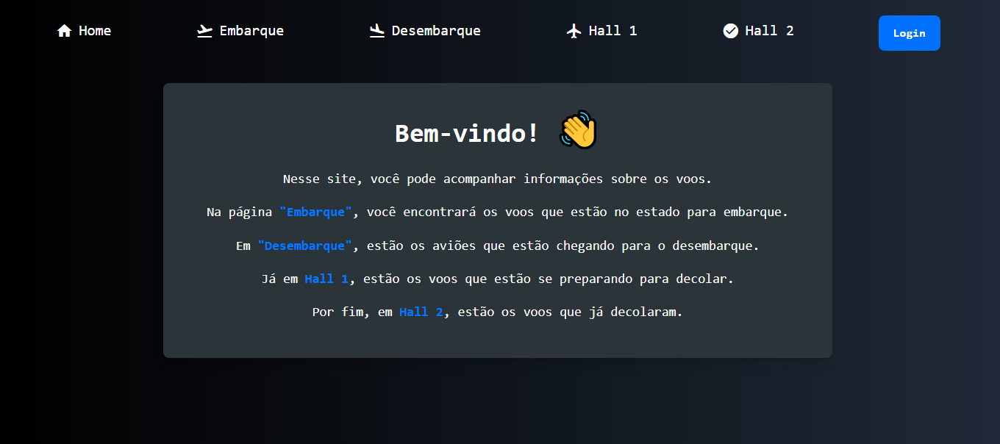
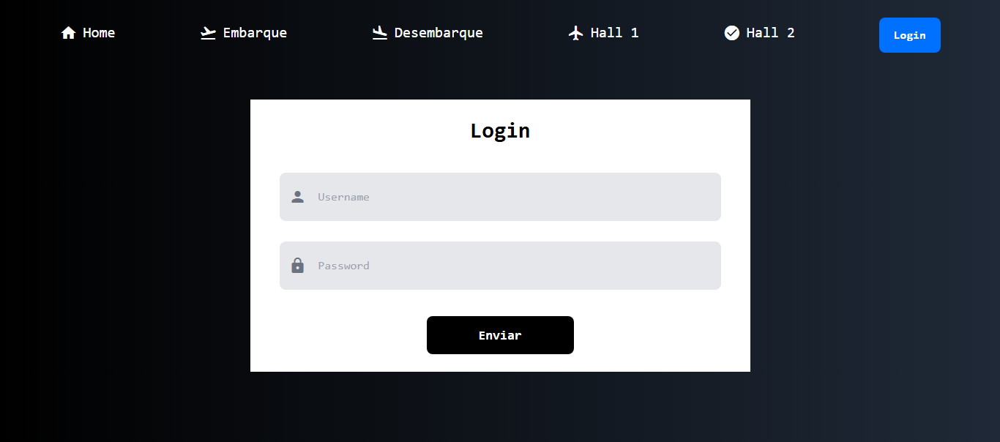
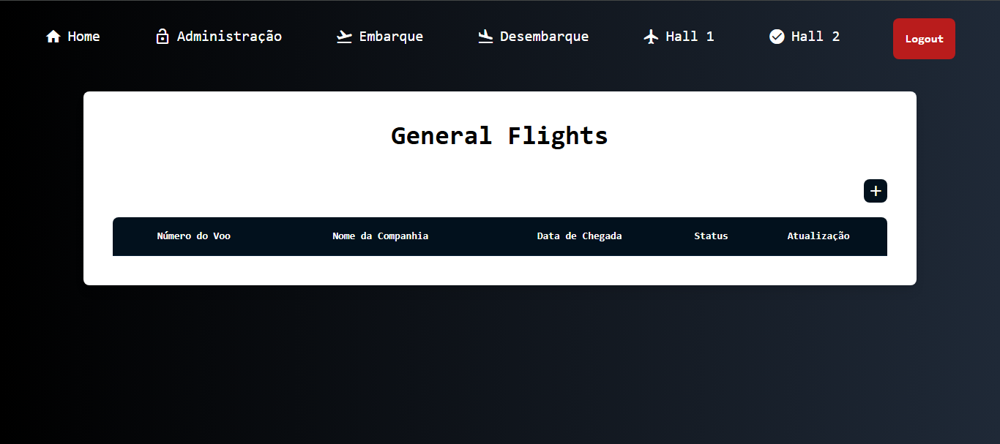
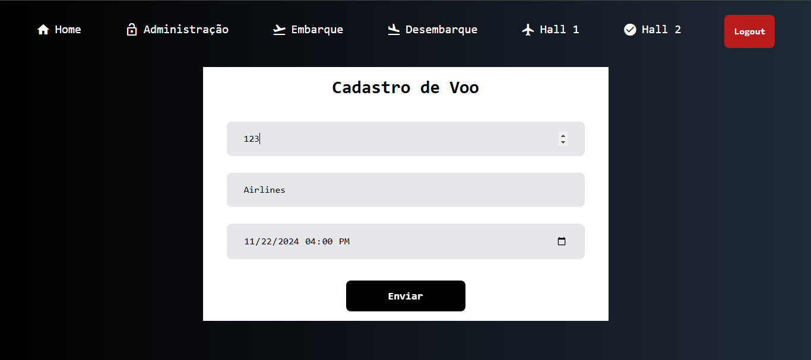
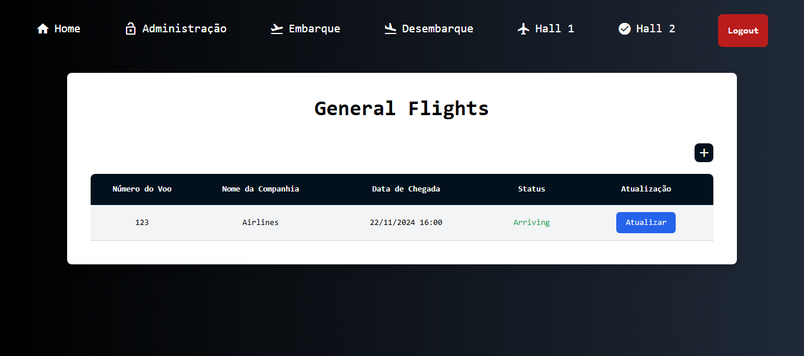

# Airport System

> Breve descrição do projeto. Exemplo: *"Esse é um sistem web desenvolvido para o gerenciamento de voos."*

---

## 📜 Sobre o Projeto
  
*"O projeto se trata de um sistema de gerenciamento de voos, no quall um admim pode acessar as funcionalidades de cadastro e atuallização de estado dos voos. Os clientes, apenas
podem ver os totens para cada um dos voos do sistema, que apresentam as informações relevantes de cada voo cadastrado."*

---

## 🚀 Tecnologias Utilizadas
  
- **Back-end:** Java, JSP & Servlet  
- **Front-end:** HTML, CSS, Tailwind  

---

## 📸 Screenshots

### Página Inicial  

### Login do administrador  

### Tabela de voos gerais e cadastro (disponivel apenas para o admin) 

### Cadastro de Voo (apenas o admin)

### Voo cadastrado

---

## 👤 Autor
 
**Nome:** Luis Henrique Aguiar  
**E-mail:** luis.aguiar@aluno.ifsp.edu.br  

---
